# **Traffic Sign Recognition** 

## Writeup

### You can use this file as a template for your writeup if you want to submit it as a markdown file, but feel free to use some other method and submit a pdf if you prefer.

---

**Build a Traffic Sign Recognition Project**

The goals / steps of this project are the following:
* Load the data set (see below for links to the project data set)
* Explore, summarize and visualize the data set
* Design, train and test a model architecture
* Use the model to make predictions on new images
* Analyze the softmax probabilities of the new images
* Summarize the results with a written report

## Rubric Points
### Here I will consider the [rubric points](https://review.udacity.com/#!/rubrics/481/view) individually and describe how I addressed each point in my implementation.  

---
### Writeup / README

### Data Set Summary & Exploration

#### 1. Provide a basic summary of the data set. In the code, the analysis should be done using python, numpy and/or pandas methods rather than hardcoding results manually.

I used the pandas library to calculate summary statistics of the traffic
signs data set:

* The size of training set is 34799
* The size of the validation set is 4410
* The size of test set is 12630
* The shape of a traffic sign image is (32*32*3)
* The number of unique classes/labels in the data set is 43

#### 2. Include an exploratory visualization of the dataset.

Here is an exploratory visualization of the data set.
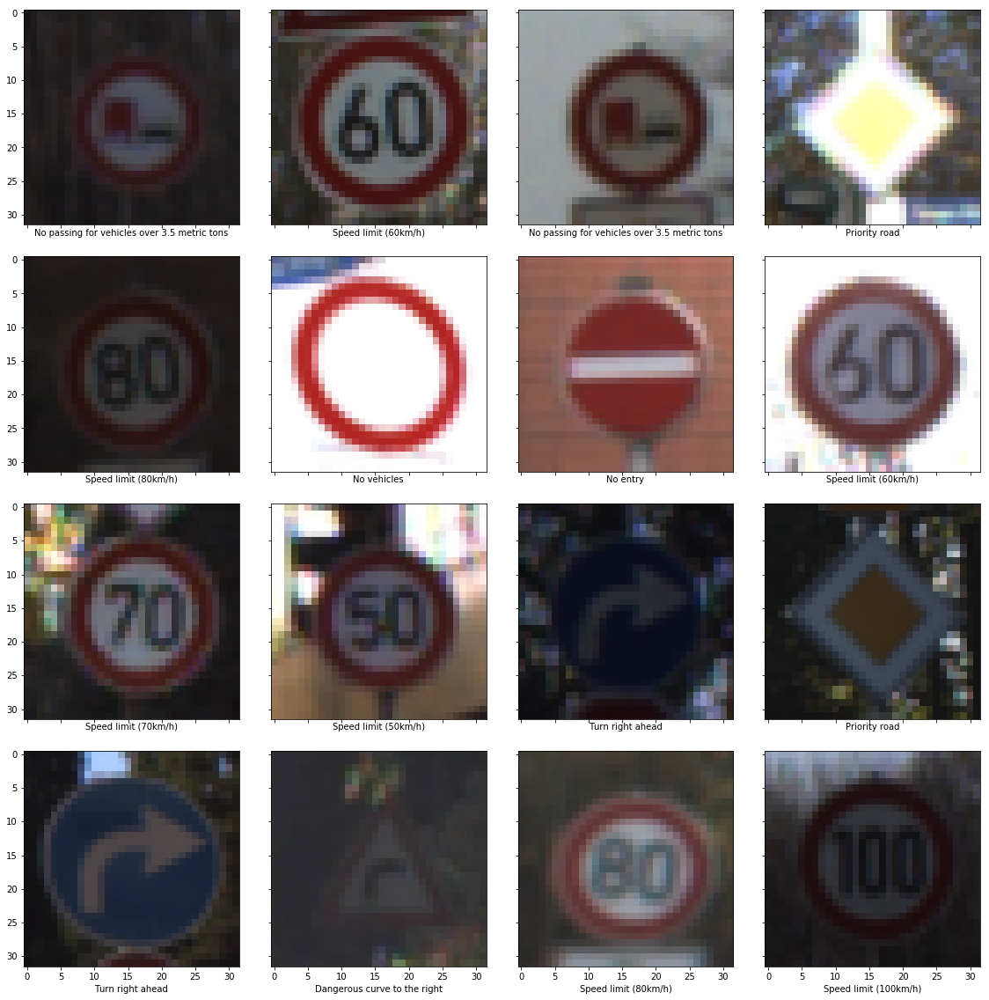

Bar charts for the dataset:

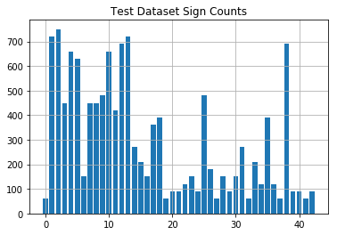
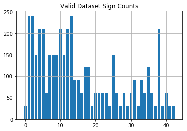

Something to be noted, parts of dataset doesn't have equal sizes. It has to be shuffled before use and even then we could fall into pitfalls. This non uniformity has to be kept in mind.

### Design and Test a Model Architecture

#### 1. Describe how you preprocessed the image data. What techniques were chosen and why did you choose these techniques? Consider including images showing the output of each preprocessing technique. Pre-processing refers to techniques such as converting to grayscale, normalization, etc. (OPTIONAL: As described in the "Stand Out Suggestions" part of the rubric, if you generated additional data for training, describe why you decided to generate additional data, how you generated the data, and provide example images of the additional data. Then describe the characteristics of the augmented training set like number of images in the set, number of images for each class, etc.)

Then the image data was normalized inorder to balance the weights space and to prevent diversing in training process.
Examples of normalization:
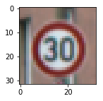
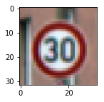
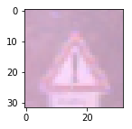
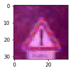

#### 2. Describe what your final model architecture looks like including model type, layers, layer sizes, connectivity, etc.) Consider including a diagram and/or table describing the final model.

My final model consisted of the following layers:

| Layer         		|     Description	        					| 
|:---------------------:|:---------------------------------------------:| 
| Input         		| 32x32x3 RGB image   							| 
| Convolution 5x5     	| 1x1 stride, valid padding, outputs 28x28x6 	|
| RELU					|												|
| Max pooling	      	| 2x2 stride,valid padding,outputs 14x14x6  	|
| Convolution 5x5	    | 1x1 stride, valid padding, outputs 10x10x16	|
| RELU					|												|
| Max pooling	      	| 2x2 stride,valid padding,outputs 5x5x16		|
| Flatten				|outputs 400									|
| Fully connected		| outputs 120									|
| RELU					|												|
| Dropout				|												|
| Fully connected		| outputs 84									|
| RELU					|												|
| Dropout				|												|
| Fully connected		| outputs 43									|
 

#### 3. Describe how you trained your model. The discussion can include the type of optimizer, the batch size, number of epochs and any hyperparameters such as learning rate.

The model was trained using AdamOptimizer and learning rate of 0.001 to minimize loss. It runs for 25 epochs with batch size of 64.

#### 4. Describe the approach taken for finding a solution and getting the validation set accuracy to be at least 0.93. Include in the discussion the results on the training, validation and test sets and where in the code these were calculated. Your approach may have been an iterative process, in which case, outline the steps you took to get to the final solution and why you chose those steps. Perhaps your solution involved an already well known implementation or architecture. In this case, discuss why you think the architecture is suitable for the current problem.

My final model results were:
* training set accuracy of 0.997
* validation set accuracy of 0.961 
* test set accuracy of 0.947

LeNet-5 was choosen as the base architecture as the original experimentation was based on the classification of the number images, this problem has many images with the numbers in them and the overall problem is almost similar to what LeNet-5 first solved. Last layer was made to classify 43 different traffic signs instead of regular 10 class classificaiton of LeNet-5. 

For the first iteration, number of epochs=10, batch size = 128 and the sigma(weight variance) was selected to be 0.1.
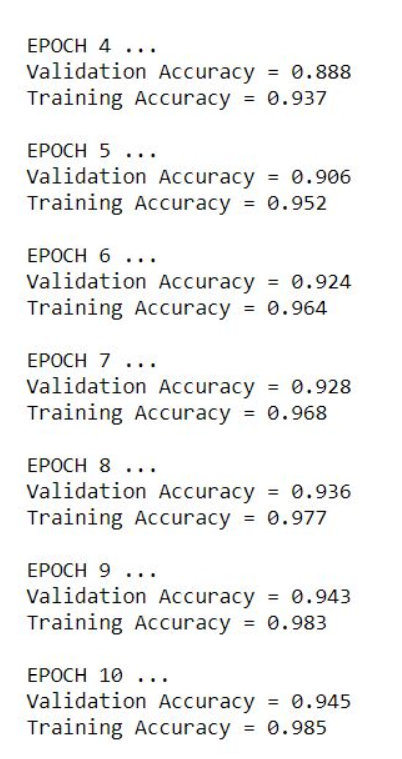

the validation accuracy went upto 94.5

For the second iteration, number of epochs=20, batch size = 128 and the sigma(weight variance) was selected to be 0.08.
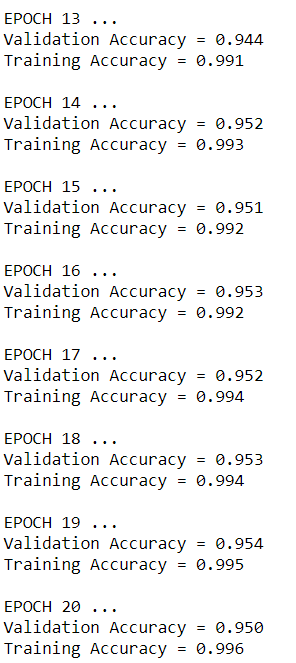

The validation accuracy went upto 95.0

For the second iteration, number of epochs=25, batch size = 64 and the sigma(weight variance) was selected to be 0.08. In addition to these one dropout layer was added before last 2 fully connected layer.
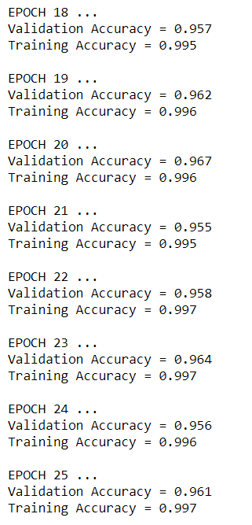

The validation accuracy went upto 96.1
Dropout layer has played an important role to help train neural network not relying on certain subset of neurons by dropping out 50% neurons randomly while training.
This model has pretty good accuracy and thus this was selected as the final architecture.

### Test a Model on New Images

#### 1. Choose five German traffic signs found on the web and provide them in the report. For each image, discuss what quality or qualities might be difficult to classify.

I downloaded test images from German Traffic Sign Recognition dataset on the web. I used 16 of the random images to test the model. 
The image in 4th row and 3rd column is difficult to classify. It's classified as speed limit 80km/h, but it could easily classified as other speed limit.

#### 2. Discuss the model's predictions on these new traffic signs and compare the results to predicting on the test set. At a minimum, discuss what the predictions were, the accuracy on these new predictions, and compare the accuracy to the accuracy on the test set (OPTIONAL: Discuss the results in more detail as described in the "Stand Out Suggestions" part of the rubric).

Here are the results of the prediction:

| Image									        |     Prediction	        					| 
|:---------------------------------------------:|:---------------------------------------------:| 
| Keep right      								| Keep right   									| 
| No passing for vehicle over 3.5 metric ton	| No passing for vehicle over 3.5 metric ton	|
| Speed limit 60km/hr							| Speed limit 60km/hr							|
| Right of way at next intersection				|Right of way at next intersection				|
| Right of way at next intersection				|Right of way at next intersection				|

The model was able to correctly guess 5 of the 5 traffic signs, which gives an accuracy of 100%. The accuracy is higher than the test set accuraccy and it might have resulted from the fact that there are very few test samples that I selected.

#### 3. Describe how certain the model is when predicting on each of the five new images by looking at the softmax probabilities for each prediction. Provide the top 5 softmax probabilities for each image along with the sign type of each probability. (OPTIONAL: as described in the "Stand Out Suggestions" part of the rubric, visualizations can also be provided such as bar charts)

Finally, the first five image with top 5 probability of classification:
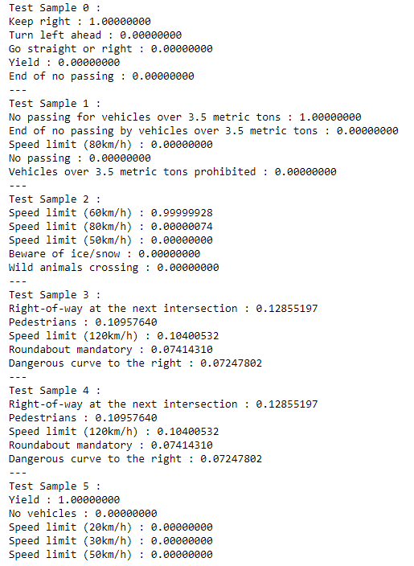
